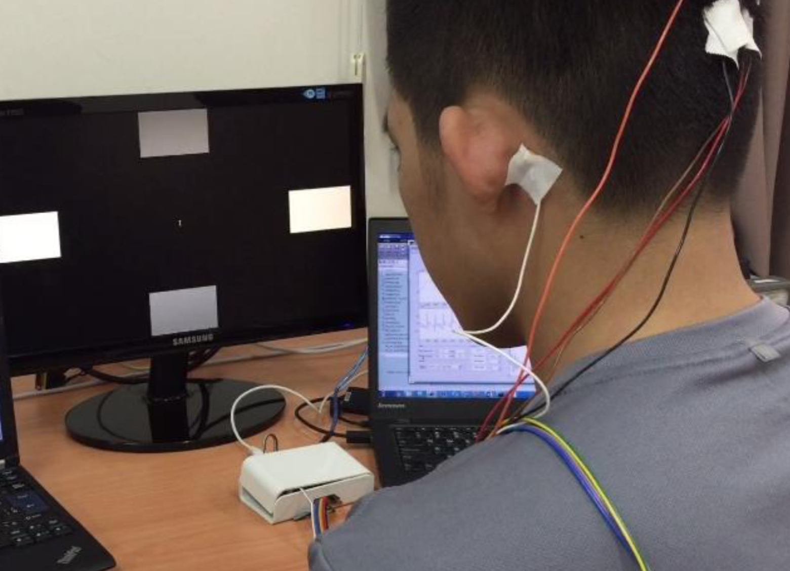

# Simple BCI Experiment: Alpha Waves (Open and Close Eyes)

## What is alpha waves
(to be added)

## Experiment Description

### Recording
We use WEEG, a portable, low-cost, 4-bit 8-channel EEG recoding system, to record brain signal for the experiment.

Read more about WEEG at: https://github.com/bobvo23/WEEG_SigPro

EEG data is recorded in two differential channels. Gelled Electrodes are placed on the subject’s scalp according to the **International Electrode (10-20) Placement System.** One Ground (bias) electrode is placed on the left mastoid. The differential pair of channel two is placed on the **Oz and O2** (image below). The **sampling rate is 250 Hz**. 

The exact placement of the electrodes is as folows:
- Left Mastoid: DRL
- Right astoid: CH1-
- O2: CH1+
- O1: CH2+
- Oz: CH2- 

    

### Protocol
The subject is a student (23-year-old) who participated voluntarily in this experiment. The experiment comprises two phases. First, the subject sits and relaxes on a chair with his eyes open for 15s. There are none stimuli in front of the subject’s eyes. Second, the subject **closes his eyes in 5s** and **opens his eye in 5s** for every trial. This protocol is illustrated in the figure below. 

    

Every run consists at least five trials. We conduct five runs in the session. 

## Signal Processing

### Pre-processing:
EEG data was **high-pass filtered at 0.3Hz** to avoid DC drift and a **low-pass filter at 43Hz** because the signal of interest would be around 8-12Hz. Data is analyzed and visualized using a Matlab Graphical User Interface (GUI). High and low-pass filtered was perfomed on the run.

### Feature extraction
The Power Spectrum Density (PSD) graph of one run is presented in the image below. The result coherences with the hypothesis in which PSD of alpha waves is high (in red color) when subject’s eye is close; PSD of alpha waves is low when subject’s eye is open and relax.

    

### Machine Learning: classifying open and close eyes
Comming soon...

## Usage
Run:
1. `data_exploration.m` to understand the data structure and see some visualization
2. `feature_extraction_classification.m` to see how feature extraction and classification using machine learning are done.