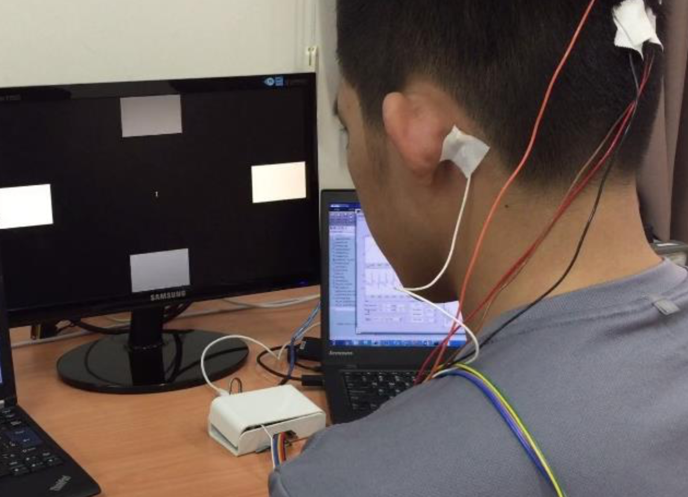

# Simple BCI Experiment: SSVEP

## Experiment Description

### Recording
We use WEEG, a portable, low-cost, 4-bit 8-channel EEG recoding system, to record brain signal for the experiment.

Read more about WEEG at: https://github.com/bobvo23/WEEG_SigPro

EEG data is recorded in two differential channels. Gelled Electrodes are placed on the subject’s scalp according to the **International Electrode (10-20) Placement System.** One Ground (bias) electrode is placed on the left mastoid. The differential pair of channel two is placed on the **Oz** (channel 1) and **O2** (channel 2) (image below). The **sampling rate is 250 Hz**. 

The exact placement of the electrodes is as folows:
- Left Mastoid: DRL
- Right astoid: CH1-
- O2: CH1+
- O1: CH2+
- Oz: CH2-

    

(Same as in the experiment of open and closed eye)

### Protocol
This experiment is set up based on the SSVEP phenomena, a common technique in BCI. When stimuli (i.e. flickering screen) are presented to the subject at a certain frequency, his brains wave will boost up at this frequency significantly. 

A 26-years old subject sits on a chair and stares at the stimulus LCD screen. The flickering screen will alternate between stimuli (showing flickering at **6.6Hz**, **7.5Hz**, **8.75Hz**, and **10Hz**) for **10s** and non-stimuli for **10s**. We record **four trial** in a run. 

The subject looks at one of these frequencies, **6.6Hz, 7.5Hz, 8.75Hz, and 10Hz, respectively for every trial**. 

    

## Signal Processing

### Pre-processing:
Same as in the alpha waves experiment

### Feature extraction
Below is the spectrogram of Channel 2 (Oz)

    

Spectrogram of an SSVEP session is the spectrogram of the recording. The window for the spectrogram calculation is 2000; window overlap is 80%; sampling rate is 250 sample/second. Red marks in the spectrogram represent high power area where as blue marks denotes low power. Long red stripe at target frequencies (6.6Hz, 7.5Hz, 8.75Hz, and 10Hz) indicate Evoked Potential of the brain.

#### Resonance frequencies

### Machine Learning: classifying open and close eyes
Comming soon...

## Usage
Run 'example_open_close.m' to see the analysis.